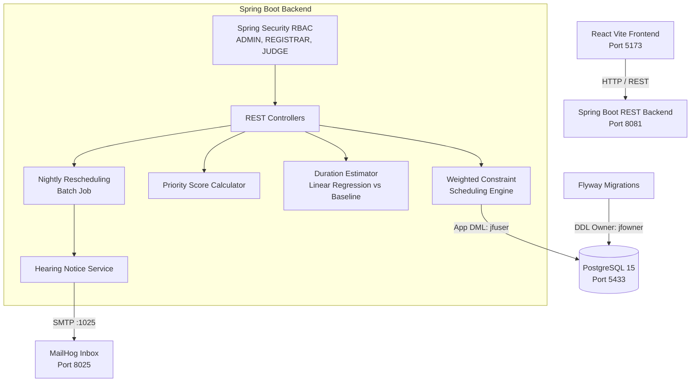

# JudicialFlow: Intelligent Court Hearing Scheduling & Decision Support

> **MANDATORY DISCLAIMER**: All performance figures, benchmark reports, and demonstration datasets in this repository are simulation outputs on synthetic data calibrated to approximate National Judicial Data Grid (NJDG) aggregates under stated mathematical assumptions. They are not empirical observations of live court dockets and do not represent evidence of real-world court impact.

---

## 1. Overview & Architecture

JudicialFlow is a production-grade, Spring Boot and React decision-support platform designed to optimize trial court hearing scheduling in Indian district and taluka courts.

Rather than acting as an opaque black box, JudicialFlow combines:
- **Transparent Multi-Criteria Priority Scoring**: Transparent linear weighting of statutory urgency, case aging, and prior adjournments.
- **Weighted Constraint-Satisfaction Scheduling Engine**: Hard constraint enforcement (no double bookings, bench availability) with soft penalty minimization (priority ordering, judge workload balance, schedule churn).
- **Explainable Decision Logs**: Audit trails tracking runner-up candidates and exact reasons why alternative time slots were rejected.
- **Two-Role Database Hardening**: Database-level role separation guaranteeing immutability of audit logs.



---

## 2. Roles, Authentication & Dev Credentials

> [!WARNING]
> **DEVELOPMENT PROFILE ONLY**: Dev user credentials and pre-seeded accounts are active strictly under the Spring Boot `dev` profile (`-Dspring-boot.run.profiles=dev`). Never enable the dev profile in production environments or expose these credentials on public networks.

### Pre-Seeded Application Accounts (Dev Profile)

| Username | Password | Role | Permitted Capabilities |
|---|---|---|---|
| `admin` | `admin123` | `ROLE_ADMIN` | Full administrative control, batch jobs, simulation benchmarks, audit log inspection. |
| `registrar` | `registrar123` | `ROLE_REGISTRAR` | Case docket management, schedule proposal review, approval/rejection, manual slot override. |
| `judge` | `judge123` | `ROLE_JUDGE` | Read-only access to judge dockets, daily cause lists, case drawer. Write actions return `403 Forbidden`. |

### Database Roles & Privilege Separation

The PostgreSQL database enforces two distinct roles configured in `docker/init-db/01-init-roles.sql` and migration `V19`:

1. **Migration Owner (`jfowner` / `jfpass`)**:
   - Owns all tables, sequences, and schemas.
   - Executes Flyway DDL migrations.
2. **Application User (`jfuser` / `jfpass`)**:
   - Restricted to DML operations (`SELECT`, `INSERT`, `UPDATE`, `DELETE`) on standard tables.
   - **Audit Immutability Enforced**: The application user has **zero** `UPDATE`, `DELETE`, `TRUNCATE`, or `TRIGGER` privileges on `audit_log_entries` and does not own the table. Attempting `ALTER TABLE ... DISABLE TRIGGER` throws `must be owner of table`.

---

## 3. How to Run

### Step 1: Start PostgreSQL and MailHog via Docker Compose
From the `judicialflow` directory:
```bash
docker compose up -d
```
- PostgreSQL 15 runs on `localhost:5433`.
- MailHog Web UI is accessible at [http://localhost:8025](http://localhost:8025).

### Step 2: Start Spring Boot Backend (Dev Profile)
```bash
mvn spring-boot:run -Dspring-boot.run.profiles=dev
```
- API starts at [http://localhost:8081](http://localhost:8081).
- Swagger UI / OpenAPI docs: [http://localhost:8081/swagger-ui/index.html](http://localhost:8081/swagger-ui/index.html).

### Step 3: Start React Frontend
From the `frontend` directory:
```bash
npm install
npm run dev
```
- Dashboard opens at [http://localhost:5173](http://localhost:5173).

### Step 4: Run Simulation & Benchmarks

1. **Quick Simulation Mode (3 seeds, 4 scenarios, no sensitivity, ~65 seconds)**:
   ```bash
   mvn test -Dtest=BenchmarkRemeasurementTest
   ```
   Or via Spring Boot CLI:
   ```bash
   mvn spring-boot:run -Dspring-boot.run.arguments="--simulation --quick"
   ```
   Generates `reports/simulation-report.html`, `reports/simulation-report.json`, and `reports/simulation-summary.md`.

2. **Full Research Benchmark**:
   - **Full Scenarios without Sensitivity (10 seeds, 4 scenarios)**: ~207 seconds (~3.5 minutes).
   - **Sensitivity Analysis Sweep (5 seeds, 8 variations, 2 scenarios)**: ~402 seconds (~6.7 minutes).
   - Full reports written to `reports/`.

---

## 4. Test Execution & Verification

### Backend Tests (Maven)
The test suite runs against PostgreSQL Testcontainers with role separation:
```bash
mvn clean test
```
All integration and unit tests are executed.

### Frontend Tests & Type Checking (npm)
From the `frontend` directory:
```bash
# Run unit tests via Vitest
npm test -- --run

# Run ESLint
npm run lint

# Check TypeScript types
npx tsc --noEmit

# Production build
npm run build
```

---

## 5. System Limitations & Findings Summary

For full mathematical methodology and empirical analysis, consult [docs/limitations.md](docs/limitations.md) and [docs/simulation-methodology.md](docs/simulation-methodology.md).

Key empirical findings from the 10-seed simulation benchmark:
1. **Outperforms Type-Blind FCFS**: The weighted scheduling engine reduces statutory priority delay across all load conditions (-1.78 days at load 0.70 to -36.43 days at load 1.60 vs FCFS).
2. **Does NOT Outperform FCFS-Tiered on Statutory Delay**: Rigid priority tiering achieves lower statutory delay (+3.10 to +6.31 days worse for engine vs tiered).
3. **Costs Non-Priority Cases More**: Balancing age, workload, and soft penalties results in non-priority cases (CIVIL, CRIMINAL_OTHER) waiting longer than under strict tiered or type-blind queues.
4. **Aging Cap Dynamics**: Under standard weights, newly filed BAIL cases (score 52.0) cannot be overtaken by aged CIVIL cases (score 8.0 + max 25.0 aging = 33.0) purely via elapsed time.
5. **Core Value**: Configurable, explainable, and tamper-resistant scheduling decision support.

---

## 6. Project Documentation Index

- [Live Demonstration Script (docs/demo-script.md)](docs/demo-script.md)
- [System Limitations & Trade-Offs (docs/limitations.md)](docs/limitations.md)
- [Simulation & Validation Methodology (docs/simulation-methodology.md)](docs/simulation-methodology.md)
- [Duration Estimator Specification (docs/duration-estimator.md)](docs/duration-estimator.md)
- [Scheduling Engine Architecture (docs/scheduling-engine.md)](docs/scheduling-engine.md)
